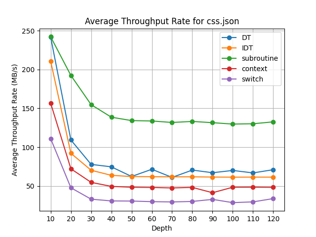
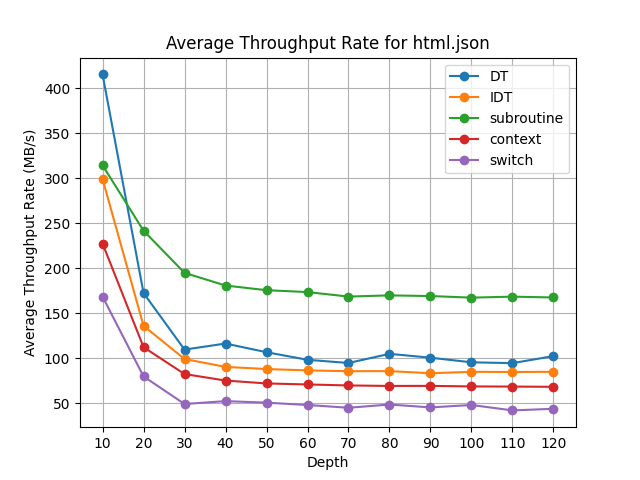
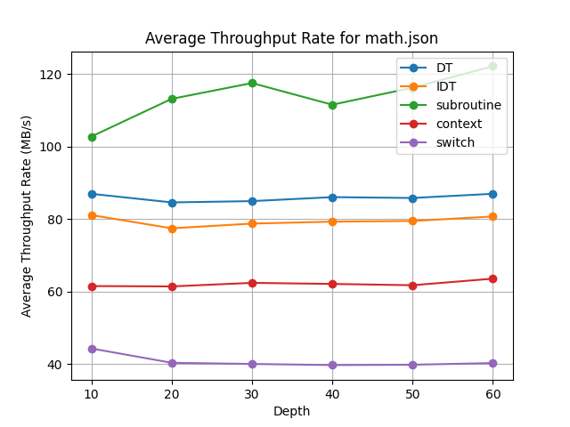
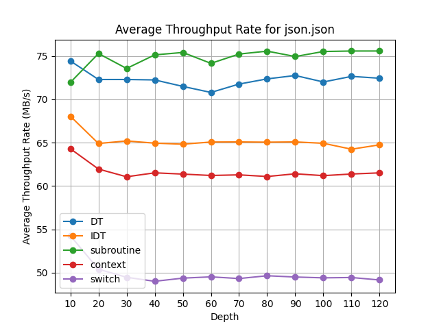
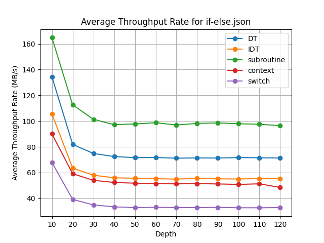
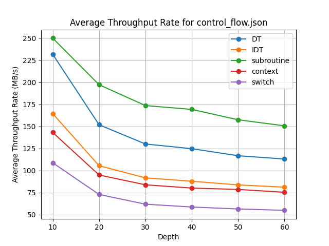
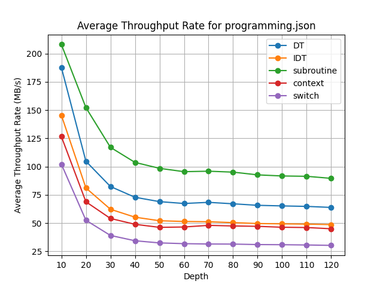
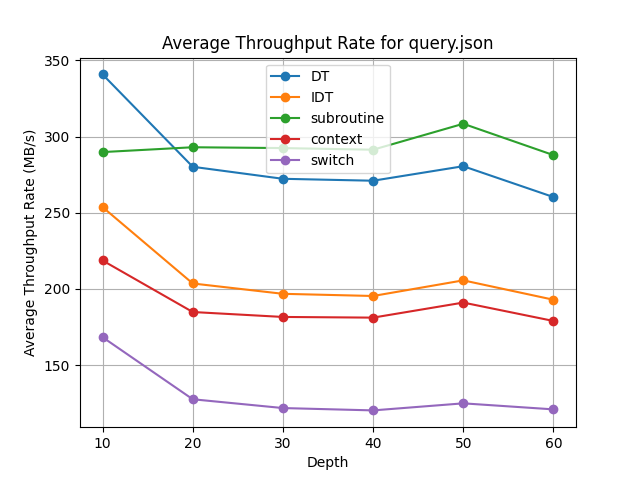
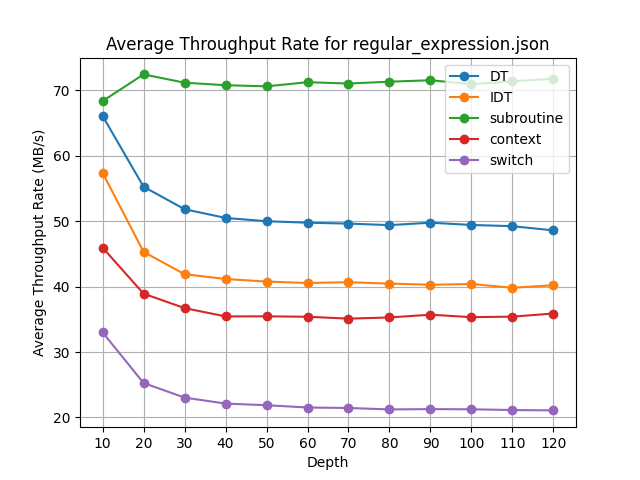

# Evaluating Fast VM Technics for Fuzzing.

## Instruction Set

There are five different types of instructions supported by the virtual machine.

| Instruction                      | Behavior                                                                                     |
|----------------------------------|----------------------------------------------------------------------------------------------|
| Terminals                        | Output strings to the buffer(Generated by grammar)                                                                |
| Non-terminals                    | Store the context into the calling stack; randomly choose a sub-program(sub-node in the grammar), and switch to it.(Generated by grammar) |
| Production Rules (expression)    | Store the context and push it into the calling stack; Switch to the program this production rule represents.(Generated by grammar) |
| RET                              | Pop the calling stack, re-store the program and IP                                           |
| HALT                             | Halt the virtual machine immediately                                                         |


### Threading Models 
In computer science, threaded code is a programming technique where the code has a form that essentially consists entirely of calls to subroutines. It is often used in compilers, which may generate code in that form or be implemented in that form themselves. The code may be processed by an interpreter or it may simply be a sequence of machine code call instructions.[*wikipedia*](https://en.wikipedia.org/wiki/Threaded_code)
## Direct Threading Model
Direct Threaded Code is a method of implementing a language interpreter where each operation or instruction points directly to the machine code that implements it. This is the simplest form of threaded code. Each entry in the thread is a pointer to a function or machine instruction. The control flow follows the sequence of instructions by directly invoking the corresponding machine code or function for each operation.

In Direct Threaded Code:
1. Each instruction contains the address of the machine code for that instruction.
2. The interpreter reads the next instruction, jumps directly to the code, and repeats the process.

***With this threading model, we probably built the fastest single core fuzzer in the world.***

## Indirect Threading Model
Indirect Threaded Code uses an additional layer of indirection. Instead of each instruction pointing directly to the machine code, it points to an address that contains the address of the machine code. This allows for more flexible modifications since the addresses in the intermediate layer can be updated without modifying the actual threaded code.

In Indirect Threaded Code:

1. Each instruction points to another address (in a table, for example), which then points to the actual machine code.
2. The interpreter retrieves the next instruction, follows the pointer to find the address of the machine code, and then jumps to it.


## Subroutine Threading Model
Subroutine Threaded Code involves each instruction being implemented as a subroutine call, meaning each entry in the thread directly calls a subroutine. This is common in systems that have efficient subroutine calls, like some modern CPU architectures.

In Subroutine Threaded Code:

1. Each instruction is a subroutine call.
2. After the subroutine executes, the return mechanism (usually a RET instruction) brings control back to the interpreter.

## Context Threading Model
Each instruction in a virtual machine’s instruction set is associated with a piece of native code or a function that directly handles that instruction’s execution. The key idea is to reduce the overhead of instruction dispatching by eliminating repetitive decoding or indirect jumps for each instruction. This is often achieved by maintaining a direct mapping between virtual machine instructions and the addresses of their corresponding execution handlers.

In Context Threading Model:
	1. In a traditional interpreter, after fetching an instruction, the interpreter decodes it and then looks up which function to call to execute it. This decoding and lookup can introduce overhead.


## Switch Threading Model
switch threading (also called switch-dispatch or switch-based interpretation) is a common control flow technique for executing bytecode or intermediate representation (IR) instructions. In this model, each instruction is decoded and executed in a loop using a switch statement in a host programming language, where each case in the switch corresponds to a different bytecode instruction.

In Switch Threaded code:

1. The interpreter reads one bytecode instruction at a time from a bytecode stream or array.
2. Dispatch: The interpreter uses a switch or if-else construct to jump to the corresponding code that implements the logic for the current instruction.
3. Execution: The code in the relevant switch case (or branch) is executed, modifying the virtual machine’s state (like its registers, stack, etc.).
4. Repeat: After executing the instruction, the interpreter fetches the next instruction, repeats the dispatch, and execution continues.

How to use
```
$ clang++ -std=c++20 -stdlib=libc++ [IDT.cpp | DT.cpp | subroutine.cpp ...] -o generator
./generator -d <number> -p <path> -o <output file> [-c <count of loops> | --endless]
```
C++ is used to compile grammar rules into virtual machine, please make sure your C++ toolchain support C++20 or above.

**Bechmark Result:** 










